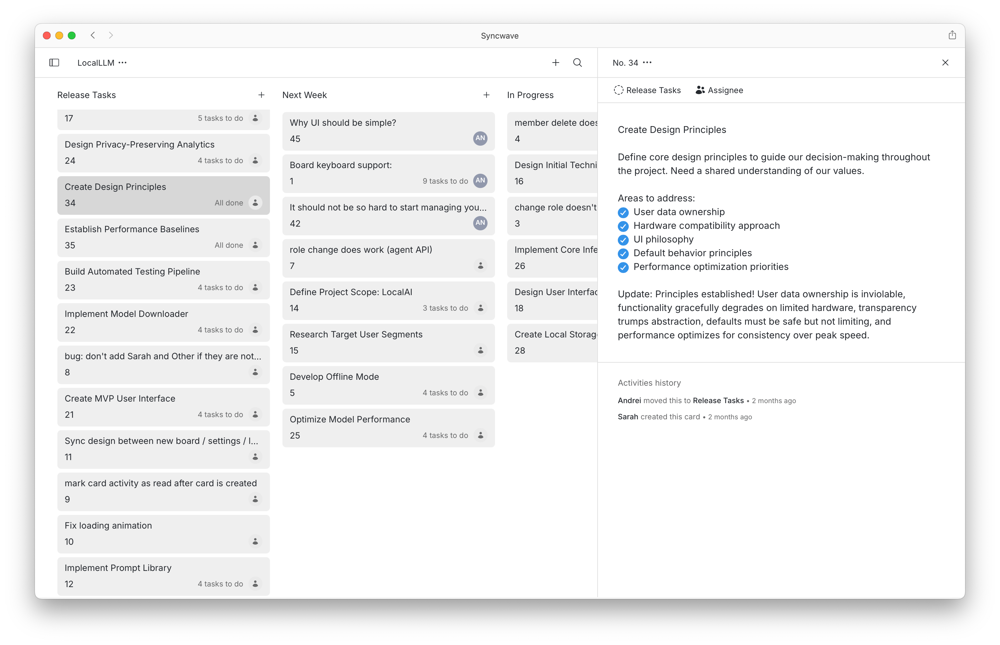

<h1 align="center">Syncwave</h1>

<p align="center">
  Syncwave is a real-time kanban board that's simple and beautiful.
</p>
<h4 align="center">
  <a href="https://discord.com/invite/FzQjQVFdQz">
    </a>
  <a href="https://github.com/syncwavedev/syncwave/blob/main/LICENSE">
    </a>
</h4>
<h4 align="center">
  <a href="https://app.syncwave.dev/demo">Demo</a>
  &middot;
  <a href="https://github.com/syncwavedev/syncwave/issues/new?labels=bug&template=bug-report---.md">Report Bug</a>
  &middot;
  <a href="https://github.com/syncwavedev/syncwave/issues/new?labels=enhancement&template=feature-request---.md">Request Feature</a>

</h4>

<picture>
    <source media="(prefers-color-scheme: dark)" srcset="./packages/www/src/assets/syncwave-window-screenshot-dark-v2.png">
    <source media="(prefers-color-scheme: light)" srcset="./packages/www/src/assets/syncwave-window-screenshot-light-v2.png">
    
</picture>

We built Syncwave because we were tired of kanban boards that do too much.

Most boards bury you in features. Settings, integrations, workflows, automations. You spend more time configuring than working.

Syncwave does less on purpose.

Open it, create cards, drag them between columns, and watch your teammates' changes appear instantly—that's it.

That's the whole product.

<details>
  <summary>Table of Contents</summary>
  <ol>
    <li><a href="#quick-start">Quick start</a></li>
    <li><a href="#self-hosted">Self-Hosted</a></li>
    <li><a href="#documentation">Documentation</a></li>
    <li><a href="#help">Help</a></li>
    <li><a href="#license">License</a></li>
    <li><a href="#contact">Contact</a></li>
    <li><a href="#acknowledgments">Acknowledgments</a></li>
  </ol>
</details>

## Live Demo

Try it at [app.syncwave.dev/demo](https://app.syncwave.dev/demo). No signup required.

## Quick start

Use our hosted version at [app.syncwave.dev](https://app.syncwave.dev) or self-host it.

## Self-Hosted

Pull the Docker image and run it:

```sh
docker run --name syncwave -d -p 8080:8080 -v syncwave-data:/data syncwave/syncwave
```

Then open `http://localhost:8080/`.

Docker Compose:

```yaml
services:
  syncwave:
    image: syncwave/syncwave
    container_name: syncwave
    restart: unless-stopped
    ports:
      - '8080:8080'
    volumes:
      - syncwave-data:/data

volumes:
  syncwave-data:
```

## Documentation

Full docs at [syncwave.dev/docs](https://www.syncwave.dev/docs).

## Help

- [GitHub Discussions](https://github.com/syncwavedev/syncwave/discussions/new/choose) for questions
- [Discord](https://discord.com/invite/FzQjQVFdQz) for quick help
- [GitHub Issues](https://github.com/syncwavedev/syncwave/issues) for bugs

## License

MIT. See [LICENSE](./LICENSE).

## Contact

Dmitry Tilyupo - tilyupo@gmail.com

Project: [https://github.com/syncwavedev/syncwave](https://github.com/syncwavedev/syncwave)

## Acknowledgments

Built with:

- [Svelte](https://github.com/sveltejs/svelte) - frontend framework
- [Node.js](https://github.com/nodejs/node) - backend runtime
- [LevelDB](https://github.com/google/leveldb) - embedded database for self-hosted version
- [FoundationDB](https://github.com/apple/foundationdb) - distributed database for hosted version
- [Tailwind CSS](https://github.com/tailwindlabs/tailwindcss) - styling
- [Astro](https://github.com/withastro/astro) - static site generator for docs
- [TypeScript](https://github.com/microsoft/TypeScript) - type safety throughout
